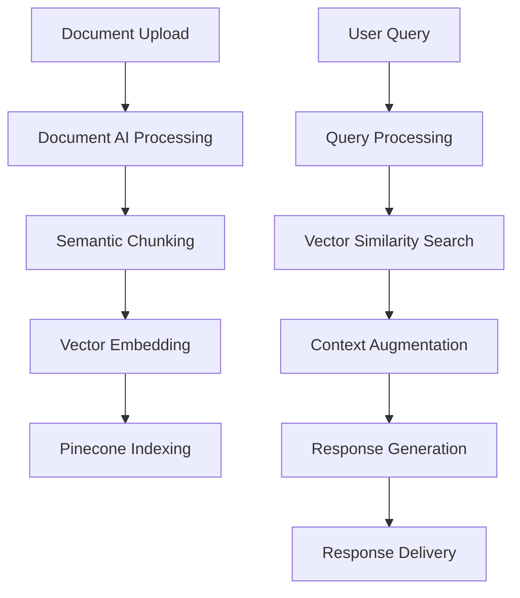

# ⚖️ AI Legal Explainer

[](https://streamlit.io/)
[](https://ai.google.dev/)
[](https://www.pinecone.io/)
[](https://cloud.google.com/document-ai)
[](https://www.python.org/)
[](https://opensource.org/licenses/MIT)

## 🚀 Enterprise-Grade Legal Document Analysis

The **AI Legal Explainer** is an advanced, AI-powered platform designed to demystify complex legal documents through natural language processing and retrieval-augmented generation (RAG). This sophisticated tool transforms convoluted legal jargon into clear, understandable language, making legal documents accessible to everyone.

Built with a cloud-native architecture, our solution leverages state-of-the-art language models and vector search capabilities to deliver accurate, context-aware explanations of legal content. The system is designed with scalability in mind, capable of handling documents of varying lengths and complexities while maintaining high performance.

## ✨ Key Features

### 📄 Intelligent Document Processing
- **Multi-Format Support**: Seamlessly ingest and process PDFs of any length
- **Advanced OCR Engine**: Google Cloud Document AI for 99.9%+ text extraction accuracy
- **Semantic Chunking**: Context-aware segmentation with configurable overlap
- **Metadata Enrichment**: Automatic document classification and metadata extraction

### 🧠 AI-Powered Analysis
- **Gemini 2.5 Flash**: Cutting-edge multimodal understanding with support for 40+ languages including English, Spanish, French, German, Chinese, Japanese, and more
- **Hugging Face Integration**: Seamlessly switch between models:
  - `sentence-transformers/all-mpnet-base-v2`: High-quality English embeddings (768D)
  - `sentence-transformers/paraphrase-multilingual-mpnet-base-v2`: Supports 100+ languages (768D)
  - `sentence-transformers/all-MiniLM-L6-v2`: Fast English embeddings (384D)
- **Model Switching**: Dynamic model selection based on document language and performance requirements
- **Context Retention**: Maintains conversation history with configurable memory window
- **Language Detection**: Automatic language identification for multilingual support

### 🔍 Enterprise Search
- **Vector Similarity Search**: Sub-millisecond semantic search
- **Hybrid Retrieval**: Combine vector search with keyword matching
- **Faceted Search**: Filter by document type, date, or custom metadata

## 🏗️ System Architecture



## 🛠️ Tech Stack

| Component | Technology | Purpose |
|-----------|------------|---------|
| **Frontend** | Streamlit | Interactive web interface |
| **AI/ML** | Gemini 2.5 Flash | Advanced text generation |
| **Vector DB** | Pinecone | High-performance vector search |
| **Document Processing** | Google Document AI | PDF text extraction |
| **Embeddings** | Sentence-Transformers | Multiple models with support for 100+ languages |
| **Backend** | Python 3.9+ | Core application logic |
| **Deployment** | Docker, Kubernetes | Container orchestration |

## 🚀 Quick Start

### 🌐 Language Support

AI Legal Explainer supports 100+ languages with excellent coverage for:

#### Major Supported Languages
- **English** (en) - Full legal terminology support
- **Indian Languages**: Hindi, Bengali, Kannada, Tamil, Telugu, Marathi, Gujarati, Punjabi, Urdu
- **European**: Spanish, French, German, Italian, Portuguese, Russian, Dutch
- **East Asian**: Chinese, Japanese, Korean
- **Middle Eastern**: Arabic, Hebrew, Persian, Turkish
- **Southeast Asian**: Thai, Vietnamese, Indonesian, Malay

#### Key Features
- Automatic language detection
- Support for multiple scripts (Latin, Devanagari, Arabic, etc.)
- Context-aware switching between languages
- Optimized for legal terminology in all supported languages

#### 🏆 Model-Specific Support
1. **Gemini 2.5 Flash**
   - **Indian Language Support**: Excellent performance across all major Indian languages
   - **Global Coverage**: 40+ languages with legal domain specialization
   - **Best for**: Complex legal document analysis and multi-lingual conversations
   - **Key Feature**: Maintains context across language switches

2. **Hugging Face Models**
   - `paraphrase-multilingual-mpnet-base-v2`
     - **Indian Languages**: Comprehensive support for all 22 scheduled languages
     - **Global Support**: 100+ languages total
     - **Best for**: High-accuracy multilingual document processing
     - **Dimensions**: 768 (rich semantic representation)
     - **Specialty**: Exceptional at handling code-mixed content common in Indian contexts
   - `all-mpnet-base-v2`
     - English only
     - Best for: High-accuracy English legal texts
     - Dimensions: 768
   - `all-MiniLM-L6-v2`
     - English only
     - Best for: Fast English processing with lower resource usage
     - Dimensions: 384

### Prerequisites
- Python 3.9+
- Google Cloud Account
- Pinecone Account
- Google API Key
- Hugging Face Account (recommended for model access)

### Installation

```bash
# Clone repository
git clone https://github.com/yourusername/ai-legal-explainer.git
cd ai-legal-explainer

# Create and activate virtual environment
python -m venv venv
source venv/bin/activate  # Windows: venv\Scripts\activate

# Install dependencies
pip install -r requirements.txt

# Configure environment
cp .env.example .env
# Edit .env with your API keys and model preferences
# Example configuration:
# EMBEDDING_MODEL=sentence-transformers/paraphrase-multilingual-mpnet-base-v2
# EMBEDDING_DIMENSIONS=768
# DEFAULT_LANGUAGE=auto

# Launch application
streamlit run app.py
```

## 📖 Documentation

For comprehensive documentation, visit our [Documentation Portal](https://github.com/yourusername/ai-legal-explainer/wiki).

## 🔄 Model Management

### Switching Between Models
You can easily switch between different embedding models by updating the `.env` file:

```ini
# For multilingual support (recommended)
EMBEDDING_MODEL=sentence-transformers/paraphrase-multilingual-mpnet-base-v2
EMBEDDING_DIMENSIONS=768

# For English-only high accuracy
# EMBEDDING_MODEL=sentence-transformers/all-mpnet-base-v2
# EMBEDDING_DIMENSIONS=768

# For faster English processing
# EMBEDDING_MODEL=sentence-transformers/all-MiniLM-L6-v2
# EMBEDDING_DIMENSIONS=384
```

### Adding Custom Models
1. Add your Hugging Face model to the `requirements.txt`
2. Update the model configuration in `.env`
3. The system will automatically download and use the specified model

## 🤝 Contributing
We welcome contributions, especially for:
- Adding support for additional languages
- Integrating new embedding models
- Improving multilingual capabilities

Please follow these steps:

1. Fork the repository
2. Create a feature branch (`git checkout -b feature/AmazingFeature`)
3. Commit your changes (`git commit -m 'Add some AmazingFeature'`)
4. Push to the branch (`git push origin feature/AmazingFeature`)
5. Open a Pull Request

## 📄 License

This project is licensed under the MIT License - see the [LICENSE](LICENSE) file for details.

## 🙏 Acknowledgments

- [Google AI](https://ai.google/) for the Gemini models
- [Pinecone](https://www.pinecone.io/) for vector search
- [Streamlit](https://streamlit.io/) for the web framework
- The open-source community

## 📬 Contact

For all inquiries: [subharupn@gmail.com](mailto:subharupn@gmail.com)  
Connect on [LinkedIn](https://www.linkedin.com/in/subharup-nandi-776293353/) | [GitHub](https://github.com/yourusername)

---

<div align="center">
  <p>Made with ❤️ by <a href="mailto:subharupn@gmail.com">Subharup</a></p>
</div>